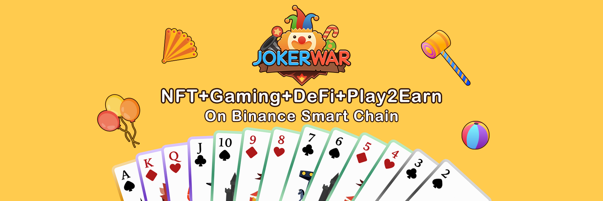

# JokerWar Intro

**JokerWar** is an NFT collectible card and play-to-earn game at the Binance Smart Chain. The basic gameplay of JokerWar is to collect a set of 52 playing cards, evolve into the NFT Joker, and ultimately win the jackpot. Players collect playing cards and “Upgrade” them into new ones. A collection of all playing cards gives you a key to the jackpot. When the jackpot is won by a player, the new season starts. Players can also play to earn with the Jokers. 

Please remember that **being the Joker is just beginning**.

**JokerWar** has a unique ecosystem and economic model, which combines the current popular mining, NFT, Collecting, Play-to-earn, GameFi, the Metaverse and other popular concepts, and innovates on this basis.

​

### 

