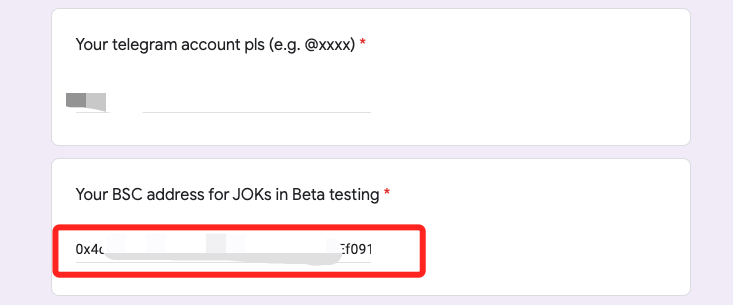
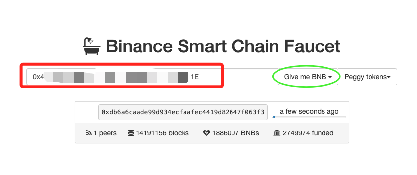
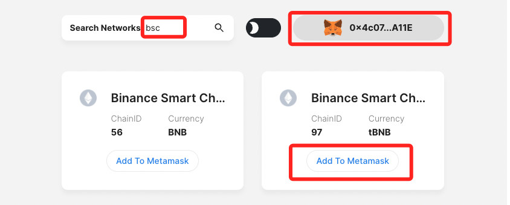
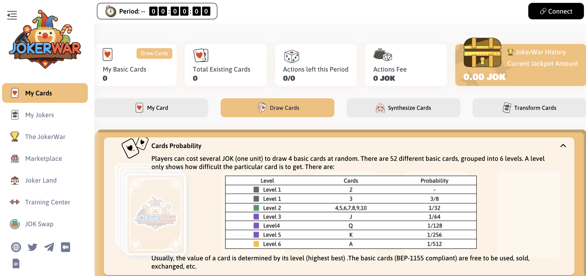

# About Beta Procedure

### **​About JokerWar Beta**&#x20;

#### a. This test is a file deletion test;&#x20;

#### b. We will send 100,000 JOK and 0.3 TBNB to each tester’ BSC address for testing. You could invite friends to apply: [https://forms.gle/jGzQ9wteKFz5Gs5J7](https://forms.gle/jGzQ9wteKFz5Gs5J7);&#x20;

#### c. The BETA will go live at 06:00 UTC on the 18th November 2021 and ends at 06:00UTC on the 24th of November 2021

### Beta Procedure&#x20;

#### a. Apply to participate [https://forms.gle/jGzQ9wteKFz5Gs5J7](https://forms.gle/jGzQ9wteKFz5Gs5J7) ;&#x20;

#### b. Get JOKs and TBNB in your BSC address for testing (you could also claim TBNB in your BSC address through [https://testnet.binance.org/faucet-smart](https://testnet.binance.org/faucet-smart));&#x20;

#### c. Add Binance Smart Chain Testnet (ID 97) through [https://chainlist.org/](https://chainlist.org) to your wallet (e.g. Metamask);&#x20;

#### d. Start game testing: [app.jokerwar.com](https://app.jokerwar.com/cards/draw)

