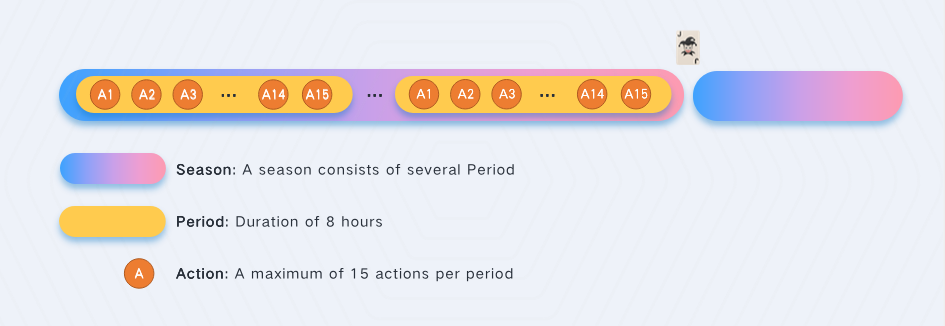

# Season, Period, Action

The game is turn based. A player can make a limited amount of turns per Period. A Period usually goes for 8 hours. When any player wins the game, a new season is started for all players.

**Season:** A season consists of several Period

**Period:** 8 hours for a period

**Action:** A player is allowed to take only 15 actions every period. There are five different actions to choose from in JokerWar, including Draw, Cards Synthesis, Transform, Equip and Start the war. Each action costs an Action Fee, and an Action Fee is 200 JOKs, which is deposited into the JokerWar jackpot.

