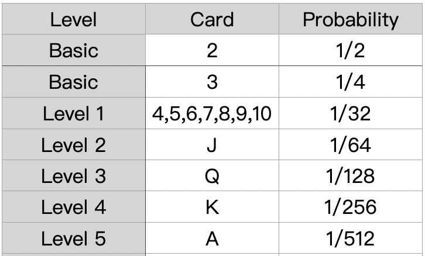

# The Basic Cards

​The Basic Cards are a standard 52-card deck comprises 52 Cards in each of the 4 suits of Spades, Hearts, Diamonds, and Clubs. Each suit contains 13 cards: Ace, 2, 3, 4, 5, 6, 7, 8, 9, 10, Jack, Queen, King. The cards are divided into 5 different levels except 2 and 3. Each card has a unique, incremental Serial Number \(ID\). Older cards with lower Serial Number \(ID\) are more valuable.

The main aim of the game is to collect unique basic cards. There are ****52 different basic cards, grouped into 5  levels except 2 and 3. A level only shows how difficult the particular card is to get. There are:

