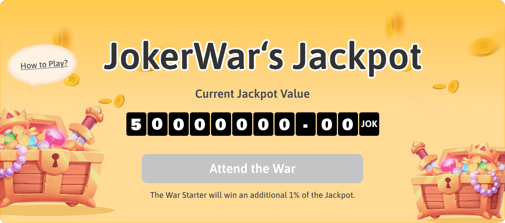

# 🃏 How To Win The Jackpot

JokerWar has a jackpot and keeps growing their value within the game season. To become a winning player and share the jackpot, there are the following steps:

#### Step 1: Draw The Basic Cards

Generals grow up from soldiers, and so do the Jokers. To own Joker, players must first purchase the Basic Cards.

Players can buy four basic cards of the lowest rank at a time, and also have a certain probability to obtain cards of higher rank.

The instructions to draw the Basic cards can be found here:



#### Step 2: Synthesize The Higher Level Cards

The Higher Level Cards have a higher value. Players need to collect 52 different basic cards with 6 levels. Using lower level cards to synthesize higher level cards is an economical strategy to win.

The instructions to synthesize the higher level cards can be found here:



#### Step 3: Transform The Basic Cards Into the Joker​

When you have collected some basic cards, you can transform them into the Black Joker. As you continue to synthesize new high-level basic cards, you can transform them with a Black Joker until you have transformed 52 different basic cards and you have gained the Red Joker.

Be aware that the Black Jokers can also play to earn in Joker War.

The instructions to Transform can be found here:



#### Step 4: Start the JokerWar, Win the jackpot

In a new season, you could use an unused Red Joker to start the war. When you are the first Red Joker to join the Joker War and start it, you become the War Starter. And you will get 1% of the Jackpot.

Red Jokers who participate in the Joker War during the season can share the jackpot together. It is important to note that a maximum of five Red Jokers are allowed to join the war in a season. Once the fifth Red Joker joins the war, other Red Jokers will not be able to continue to join during this season.

The percentage of the jackpot you win: 



