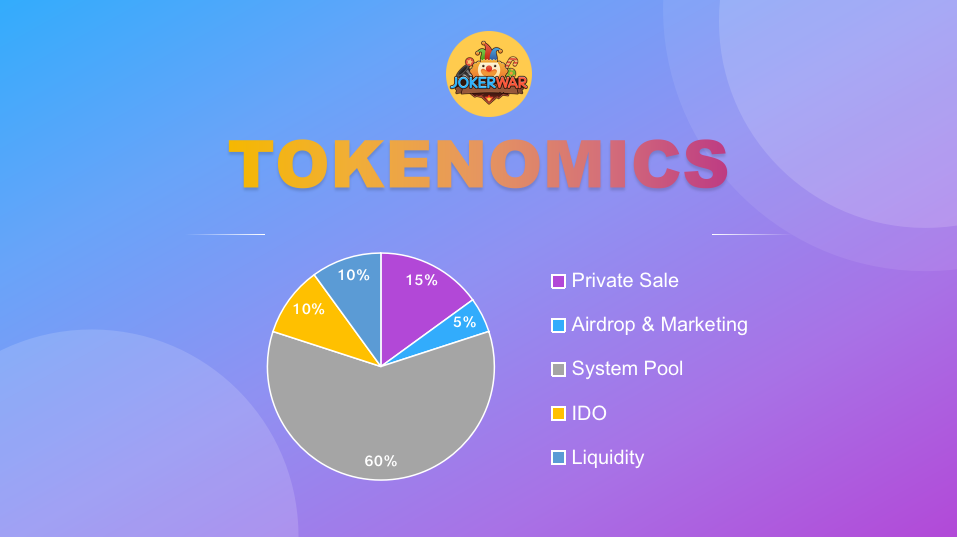

# JOK Token

* **Name:** JokerWar JOK Token
* **Symbol:** JOK
* **Decimals:** 18
* **Network:** Binance Smart Chain
* **Supply:** 100,000,000
* **Private Sale:** 15%
* **Airdrop & Marketing:** 5%
* **System Pool:** 60%
* **IDO:** 10%
* **Liquidity:** 10%
* **Action Fees:** 97% to Jackpot, 3% to team
* **Exchange Fees:** Sell 3% to team

